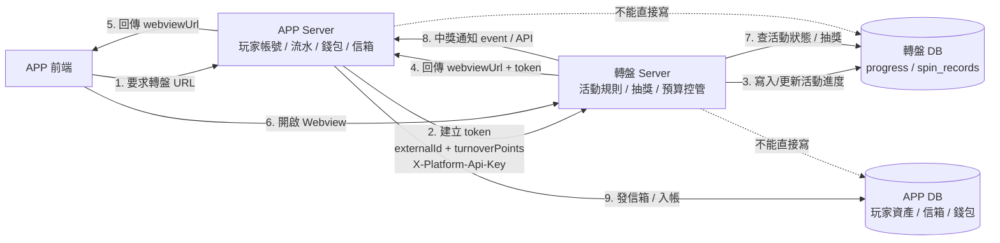
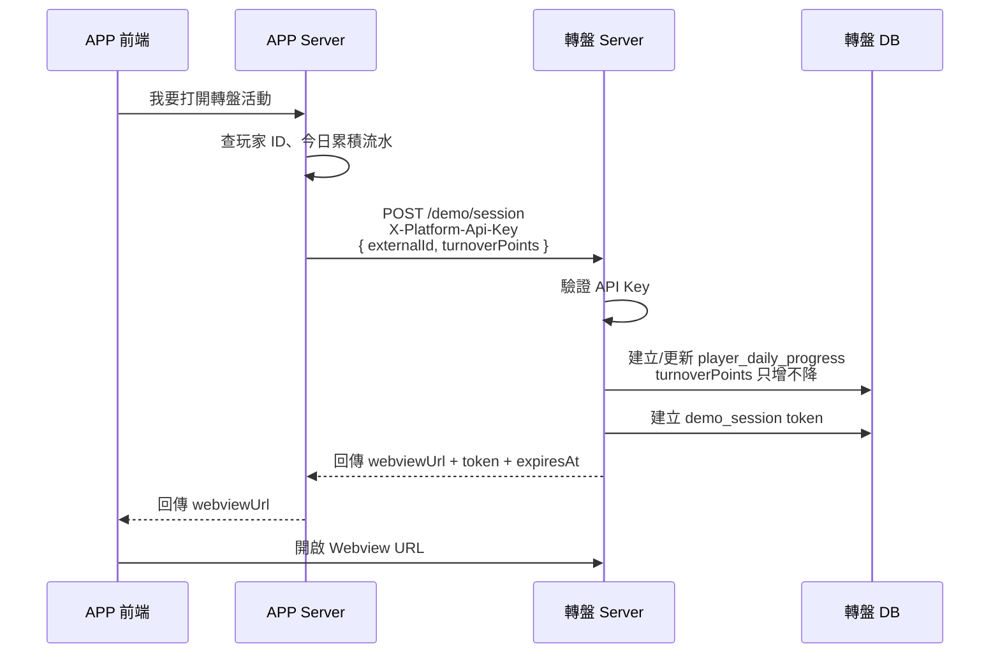
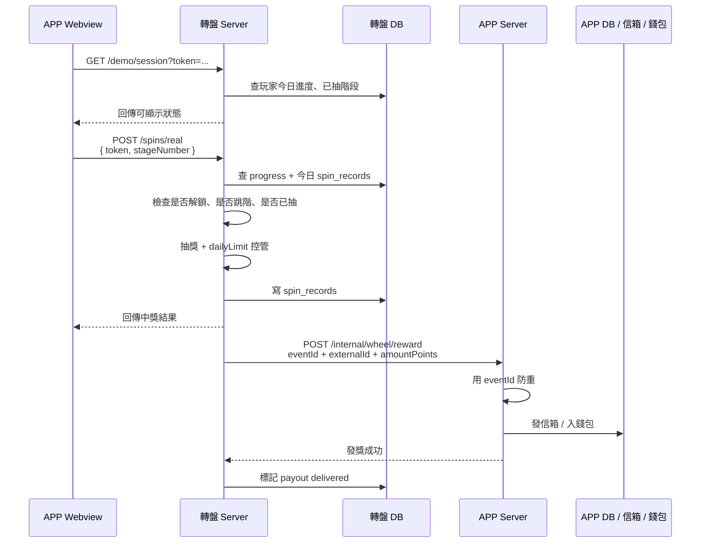
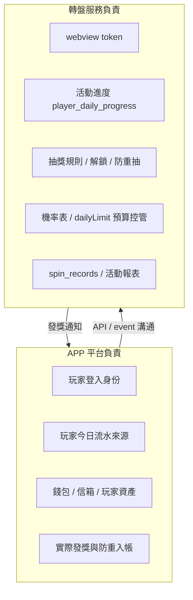

# APP 平台與轉盤服務整合流程圖

這份文件用來跟 APP server 負責人討論正式整合方式。核心原則是：轉盤服務只負責活動規則、抽獎紀錄、預算控管；玩家資產、信箱、錢包仍由 APP 平台負責。

## 如何打開流程圖

以下區塊都是 Mermaid 圖。可以用這幾種方式查看：

1. 貼到 Mermaid Live Editor：https://mermaid.live/
2. 在 GitHub / GitLab 直接看 Markdown。
3. 用 VS Code Markdown Preview 搭配 Mermaid preview extension。

## 整體架構

## 正式開啟 Webview 流程

## Webview 抽獎與發獎流程

## 責任邊界

## 對接重點

- APP Server 建立 webview URL 時，要把玩家平台 ID 與今日流水快照傳給轉盤服務。
- Webview URL 只放 token，不放流水，避免玩家竄改。
- Webview 開啟後，玩家端 API 直接打轉盤服務，不繞回 APP Server。
- 中獎後，轉盤服務不直接碰 APP DB，而是通知 APP Server 發獎。
- APP Server 發獎時要用 `eventId` 或類似欄位做防重，避免同一筆中獎通知重複入帳。
- APP Server 不直接寫轉盤 DB；轉盤服務也不直接寫 APP DB。
